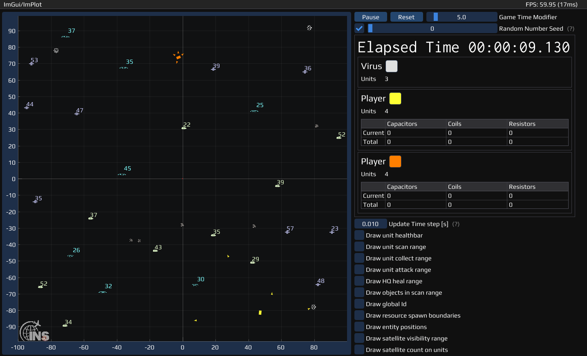

# OOP - Robot Navigation Task




## Description

This is the programming challenge of the lecture 'Object-Oriented Programming in C++'.

Program the behavior of Robots to make them collect resources, build new units and fight fierce viruses to survive.
As Robots are technical machines, they have certain limitations:
- They do not know their own position and can only locate themselves using distance measurements to satellites flying over the game board.
- They do not know where to find resources, so they have to walk around and scan their close proximity for them.

### Game rules

1. No code modifications outside of the folder `TEAMNAME` are allowed (except inside `GameState.cpp` in order to rename the `TEAMNAME` folder)
2. Win conditions
   1. Collect all resources on the game board (in multiplayer mode the player with the most resources wins)
   2. Destroy your opponents units and headquarters in multiplayer mode
   3. Do not loose your headquarters and/or all units

## Getting Started

### Working with the Repository

##### Git
- Command-line (Windows users need to install [Git](https://git-scm.com/download/win))
    ```
    git clone https://github.com/UniStuttgart-INS/OOP-RobotNavigationChallenge.git
    ```
- When downloading the Zip (instead of using command-line), make sure to manually download the libraries in the `lib` folder.

##### Conan
```shell
conan install . --build=missing -s build_type=Release
```

##### Cmake
```shell
# Linux
cmake -Bbuild/Release -S. -DCMAKE_BUILD_TYPE=Release -DCMAKE_TOOLCHAIN_FILE="build/Release/generators/conan_toolchain.cmake"
# Windows
cmake -Bbuild/Release -S. -DCMAKE_BUILD_TYPE=Release -DCMAKE_TOOLCHAIN_FILE="build/generators/conan_toolchain.cmake"
```

##### Build
```shell
cmake --build build/Release --config Release --parallel8
```

##### Run the executable
```shell
./build/bin/oop-robot-navigation-challenge
```

### Development Environment Setup

Most library dependencies are managed by Conan.io, so you just need to install the basics.


#### ArchLinux
```shell
sudo pacman -S base-devel cmake clang glfw-x11
yay -S conan # AUR package
conan profile detect --force
```

#### Ubuntu 22.04
```shell
sudo apt update
sudo apt upgrade -y
sudo apt install -y build-essential clang cmake python3-pip libglfw3-dev libglfw3
pip3 install conan --user
conan profile detect --force
```

#### MacOS
```shell
xcode-select --install
/bin/bash -c "$(curl -fsSL https://raw.githubusercontent.com/Homebrew/install/master/install.sh)"
brew update

brew install cmake llvm conan glfw3
ln -s "$(brew --prefix llvm)/bin/clang-format" "/usr/local/bin/clang-format"
ln -s "$(brew --prefix llvm)/bin/clang-tidy" "/usr/local/bin/clang-tidy"
conan profile detect --force
```

#### Windows

- From the Visual Studio [Downloads](https://visualstudio.microsoft.com/downloads#other) page, scroll down until you see Tools for Visual Studio 2022 under the All Downloads section and select the download for Build Tools for Visual Studio 2022. Check the 'Desktop development with C++' workload and check the following
  - MSVC Buildtools
  - Windows SDK
  - C++-CMake-Tools for Windows
- Install [Conan](https://conan.io/downloads.html)

## Dependencies

* Needed:
    * [cmake](https://cmake.org/) A cross-platform open-source make system
    * C++ compiler ([clang](https://clang.llvm.org/) or [gcc](https://gcc.gnu.org/) is recommended, but others work as well) for compiling the project
* Optional:
    * [Conan](https://conan.io) A distributed, open source, C/C++ package manager
* Libraries (Install yourself and change cmake link targets or let them automatically be installed by Conan):
    * [spdlog](https://github.com/gabime/spdlog) Fast C++ logging library [](https://opensource.org/licenses/MIT)
    * [fmt](https://github.com/fmtlib/fmt) A modern formatting library [](https://opensource.org/licenses/MIT)
    * [Eigen](http://eigen.tuxfamily.org) C++ template library for linear algebra: matrices, vectors, numerical solvers, and related algorithms [](https://opensource.org/licenses/MPL-2.0)
* GUI:
    * [Dear ImGui](https://github.com/ocornut/imgui) Bloat-free Immediate Mode Graphical User interface for C++ with minimal dependencies [](https://opensource.org/licenses/MIT)
    * [ImPlot](https://github.com/epezent/implot) An immediate mode, GPU accelerated plotting library for Dear ImGui. [](https://opensource.org/licenses/MIT)